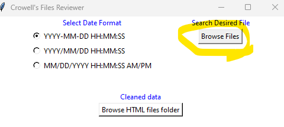

If python command is not working outside the installation folder, paste 
- app.py
- converter.py
- htmlParser.py
- uiComponents.py 
 over the python installation folder.

How to run?
```
python app.py
```

Select date Format with the radio button


Search the desired file to convert using the "Browse File" button


You can review the HTML messages with a chrome browser, to save you changes you can do `ctrl+s` and select a folder where you want to save the reviewed documents

To convert back from the HTML make sure all the reviewed documents are stored in a unified folder. Then you can search those folders using the `Browse HTML files folder` button in the app.


This will generate 2 folders:
- reviewed_data: Stores the html contents by day in a csv format
- compiled_data: Stores all the html contents in csv format


